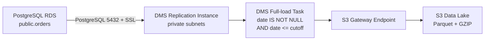

# Deploy AWS DMS: PostgreSQL RDS → S3

Thư mục này chứa notebook triển khai pipeline **one-time full load** bằng AWS Database Migration Service (DMS). Pipeline đọc các dòng cũ trong PostgreSQL RDS và ghi chúng vào Amazon S3 dưới dạng Parquet nén GZIP.

Notebook chỉ **sao chép** dữ liệu. Nó không xóa hoặc cập nhật dòng trong RDS.

## 1. Kiến trúc



Luồng mạng:

1. DMS Replication Instance nằm trong private subnet và kết nối tới RDS qua port PostgreSQL.
2. Security group của RDS cho phép inbound từ security group của DMS.
3. DMS đi tới S3 qua **S3 Gateway VPC Endpoint**, không cần public IP hoặc NAT Gateway.
4. DMS sử dụng IAM role riêng để ghi dữ liệu vào đúng bucket/prefix.

## 2. Notebook cung cấp những gì?

File chính: [`run.ipynb`](./run.ipynb).

Người sử dụng chỉ cần gọi ba hàm:

| Hàm | Mục đích |
|---|---|
| `setup()` | Tạo hoặc tái sử dụng hạ tầng, test kết nối và bắt đầu full load |
| `status()` | Xem trạng thái instance, endpoint, task, table và file S3 |
| `destroy()` | Xóa tài nguyên DMS để ngừng chi phí, nhưng giữ RDS và dữ liệu S3 |

Các hàm bắt đầu bằng `_` là helper nội bộ. Không cần gọi chúng trực tiếp.

## 3. Điều kiện trước khi deploy

### 3.1. Môi trường Python

Khuyến nghị Python 3.11 trở lên. Notebook vẫn tương thích với kernel Python 3.9 hiện tại.

Tạo virtual environment và cài thư viện:

```bash
python -m venv .venv
```

PowerShell:

```powershell
.\.venv\Scripts\Activate.ps1
python -m pip install --upgrade pip
python -m pip install boto3 python-dotenv jupyter
```

Linux/macOS:

```bash
source .venv/bin/activate
python -m pip install --upgrade pip
python -m pip install boto3 python-dotenv jupyter
```

Đảm bảo VS Code/Jupyter đang sử dụng kernel của `.venv`.

### 3.2. AWS credentials

`boto3` phải tìm thấy AWS credentials, ví dụ từ AWS CLI profile:

```bash
aws configure
aws sts get-caller-identity
```

Lệnh thứ hai phải trả về đúng AWS Account trước khi chạy notebook. Không lưu Access Key hoặc Secret Key trong `.env` hay commit lên Git.

Identity chạy notebook cần quyền cho các API mà code sử dụng:

- S3: kiểm tra/tạo bucket, cấu hình Block Public Access và liệt kê object.
- IAM: tạo/đọc/xóa role, inline policy và gắn managed policy cho DMS.
- IAM PassRole: cho phép truyền `<DMS_PREFIX>-s3-role` vào DMS target endpoint.
- DMS: tạo/đọc/sửa/xóa subnet group, replication instance, endpoint, connection test và replication task.
- EC2: đọc subnet/route table/VPC endpoint, tạo hoặc cập nhật S3 Gateway Endpoint.

Trong môi trường production nên tạo least-privilege policy cho các resource có prefix của pipeline. Không nên cấp `AdministratorAccess` lâu dài chỉ để chạy notebook.

### 3.3. RDS và network

Trước khi chạy `setup()`, kiểm tra:

- RDS đang ở trạng thái `available`.
- Hai DMS subnet thuộc cùng VPC với RDS và nên nằm ở hai Availability Zone khác nhau.
- Security group của RDS có inbound rule:
  - Type: PostgreSQL
  - Port: `5432` hoặc `RDS_PORT`
  - Source: security group được khai báo trong `SECURITY_GROUP_IDS`
- Network ACL không chặn traffic giữa DMS và RDS.
- Database user có quyền `CONNECT`, `USAGE` trên schema và `SELECT` trên bảng nguồn.
- RDS chấp nhận kết nối SSL vì source endpoint dùng `SslMode="require"`.
- Vì task bật CloudWatch logging, AWS Account cần role `dms-cloudwatch-logs-role` với managed policy `AmazonDMSCloudWatchLogsRole`. Một số account đã có role này từ lần cấu hình DMS trước; nếu chưa có thì cần tạo trước khi tạo task.

Notebook đang tạo task loại `full-load`, không phải CDC. Vì vậy PostgreSQL logical replication chưa cần thiết cho luồng hiện tại.

## 4. Cấu hình `.env`

Sao chép file mẫu:

```powershell
Copy-Item dms/.env.example dms/.env
```

Hoặc trên Linux/macOS:

```bash
cp dms/.env.example dms/.env
```

Sau đó thay toàn bộ giá trị `<...>` trong `dms/.env`.

| Biến | Bắt buộc | Ý nghĩa |
|---|---:|---|
| `AWS_REGION` | Có | Region chứa RDS, DMS và S3, ví dụ `ap-southeast-1` |
| `RDS_ID` | Có | Identifier để hiển thị và đối chiếu RDS |
| `RDS_HOST` | Có | RDS endpoint hostname, không thêm `https://` |
| `RDS_PORT` | Không | Port PostgreSQL, mặc định `5432` |
| `RDS_DATABASE` | Có | Tên database nguồn |
| `RDS_USERNAME` | Có | Database user mà DMS sử dụng |
| `RDS_PASSWORD` | Có | Mật khẩu database user |
| `SUBNET_IDS` | Có | Ít nhất hai subnet ID, phân cách bằng dấu phẩy |
| `SECURITY_GROUP_IDS` | Có | Một hoặc nhiều security group ID của DMS |
| `SOURCE_SCHEMA` | Không | Schema nguồn, mặc định `public` |
| `SOURCE_TABLE` | Không | Bảng nguồn, mặc định `orders` |
| `DATE_COLUMN` | Không | Cột timestamp dùng để xác định dữ liệu cũ |
| `ARCHIVE_RETENTION_DAYS` | Không | Tuổi tối thiểu của dữ liệu, mặc định `90` ngày |
| `S3_BUCKET` | Có | Tên bucket, không thêm `s3://`; tên phải unique toàn cầu |
| `S3_PREFIX` | Có | Thư mục logic trong bucket, ví dụ `raw/rds/orders` |
| `DMS_PREFIX` | Có | Prefix để đặt tên resource DMS/IAM |
| `DMS_INSTANCE_CLASS` | Không | Instance class, mặc định `dms.t3.medium` |
| `DMS_STORAGE_GB` | Không | Dung lượng DMS, mặc định `50` GB |

### Chọn `DATE_COLUMN`

- `closed_at_utc`: phù hợp nếu chỉ archive order đã đóng/hoàn tất. Order chưa đóng thường có giá trị `NULL` và sẽ không được chọn.
- `created_at_utc`: chọn tất cả order được tạo đủ lâu, kể cả order chưa đóng nếu hệ thống vẫn có loại order đó.

Ví dụ với:

```env
DATE_COLUMN=created_at_utc
ARCHIVE_RETENTION_DAYS=90
```

Nếu ngày chạy là `2026-08-16`, cutoff gần tương đương `2026-05-18`. DMS lấy các dòng thỏa mãn cả hai điều kiện:

```text
created_at_utc IS NOT NULL
AND created_at_utc <= 2026-05-18
```

Cutoff được tính theo UTC tại thời điểm `setup()` tạo/cập nhật table mapping.

## 5. Cách deploy

### Bước 1 — Mở notebook

Mở `dms/run.ipynb`, chọn đúng Python kernel, sau đó:

1. Restart Kernel.
2. Run All để import thư viện và định nghĩa hàm.
3. Run All không tự gọi AWS vì ba lệnh ở cell cuối mặc định đều được comment.

### Bước 2 — Chạy setup

Trong cell cuối, chạy:

```python
setup()
```

Không đóng kernel trong lúc `setup()` đang chờ AWS tạo resource. Quá trình có thể mất vài phút, chủ yếu do DMS Replication Instance.

### Bước 3 — Theo dõi

Sau khi `setup()` thông báo full load đã bắt đầu, chạy:

```python
status()
```

Có thể chạy lại `status()` nhiều lần. Hàm này chỉ đọc trạng thái, không restart task.

### Bước 4 — Xác minh dữ liệu

Chỉ coi pipeline hoàn tất khi:

- Task có trạng thái `stopped` với stop reason bình thường.
- `errors=0`.
- Table có trạng thái hoàn tất và số dòng hợp lý.
- S3 đã có file dưới `s3://<bucket>/<prefix>/`.
- Có thể đọc thử Parquet và đối chiếu số dòng/giá trị với truy vấn PostgreSQL tương ứng.

Notebook này không tự xóa dữ liệu nguồn. Việc purge RDS phải là một quy trình riêng, có kiểm tra dữ liệu S3, backup và cơ chế rollback.

## 6. Chính xác `setup()` làm gì?

`setup()` thực hiện tuần tự các bước sau.

### 6.1. Đọc và validate cấu hình

Code tìm `.env` tại:

1. `<current-working-directory>/.env`
2. `<current-working-directory>/dms/.env`

Nó kiểm tra biến bắt buộc, số nguyên dương, ít nhất hai subnet và định dạng tên schema/table/column. AWS clients được tạo theo `AWS_REGION`.

### 6.2. Chuẩn bị S3 bucket

- Nếu bucket chưa tồn tại, code tạo bucket trong đúng region.
- Nếu đã tồn tại, code tái sử dụng.
- Block Public Access luôn được bật cho cả ACL và bucket policy public.

### 6.3. Chuẩn bị IAM roles

Code tạo hoặc tái sử dụng:

1. `dms-vpc-role`
   - Trust principal: `dms.amazonaws.com`
   - Managed policy: `AmazonDMSVPCManagementRole`
   - Đây là role chuẩn mà DMS dùng để quản lý network interface trong VPC.

2. `<DMS_PREFIX>-s3-role`
   - Trust principal: `dms.amazonaws.com`
   - Inline policy `DmsS3Access`
   - Chỉ cho phép list bucket và thao tác object bên dưới `S3_PREFIX`.

Nếu role vừa được tạo, code chờ 10 giây để IAM propagate trước khi tạo endpoint.

### 6.4. Tạo DMS Replication Subnet Group

Subnet group có tên `<DMS_PREFIX>-subnet` và chứa các subnet trong `SUBNET_IDS`. Nếu group đã tồn tại, code tái sử dụng.

### 6.5. Tạo hoặc cập nhật S3 Gateway Endpoint

Vì DMS instance được tạo private, nó cần private route tới S3:

- Code lấy VPC ID từ DMS subnet group.
- Với từng subnet, code tìm route table được gắn trực tiếp; nếu không có thì dùng main route table của VPC.
- Code tìm Gateway Endpoint `com.amazonaws.<AWS_REGION>.s3`.
- Nếu endpoint đã tồn tại, code gắn thêm các route table còn thiếu.
- Nếu chưa có, code tạo endpoint mới.
- Code poll trạng thái tới khi `available`, tối đa 300 giây.

Không sử dụng botocore waiter vì một số phiên bản botocore cũ không có waiter `vpc_endpoint_available`.

### 6.6. Tạo DMS Replication Instance

Instance có tên `<DMS_PREFIX>-instance` với:

- Class từ `DMS_INSTANCE_CLASS`.
- Storage từ `DMS_STORAGE_GB`.
- Subnet group và security groups trong `.env`.
- `PubliclyAccessible=False`.

Code chờ instance chuyển sang `available` trước khi tiếp tục.

### 6.7. Tạo source và target endpoints

Source endpoint:

- Engine: PostgreSQL.
- Host/port/database/user/password từ `.env`.
- SSL mode: `require`.

Target endpoint:

- Engine: S3.
- Bucket và prefix từ `.env`.
- Data format: Parquet.
- Compression: GZIP.
- Service access role: `<DMS_PREFIX>-s3-role`.

Endpoint đã tồn tại sẽ được tái sử dụng. Nếu thay đổi host, database, credential, bucket hoặc prefix sau khi endpoint đã được tạo, cách rõ ràng nhất cho môi trường demo là chạy `destroy()` rồi `setup()` lại.

### 6.8. Test cả hai endpoint

Code gọi DMS connection test cho RDS và S3, sau đó poll kết quả:

- Cả hai `successful`: tiếp tục tạo task.
- Một endpoint `failed`: dừng ngay và hiển thị `LastFailureMessage`.
- Quá 600 giây: báo timeout.

Task không được start khi một endpoint chưa kết nối thành công.

### 6.9. Tạo table mapping

Table mapping chỉ include `SOURCE_SCHEMA.SOURCE_TABLE` và có hai source filter:

1. `DATE_COLUMN IS NOT NULL`
2. `DATE_COLUMN <= cutoff`

Hai filter được tách riêng vì DMS kết hợp các filter riêng bằng **AND**. Nếu gộp không đúng, mapping có thể chọn nhiều dòng hơn dự kiến.

### 6.10. Tạo và start replication task

Task có tên `<DMS_PREFIX>-task` với:

- Migration type: `full-load`.
- Target table preparation: `DO_NOTHING`.
- Tối đa 8 full-load subtasks.
- Commit rate: 10.000.
- CloudWatch logging được bật.

Xử lý theo trạng thái:

| Trạng thái hiện tại | Hành vi của `setup()` |
|---|---|
| Chưa có task | Tạo task mới |
| `ready` | Cập nhật mapping hiện tại rồi start |
| `starting` / `running` | Không start lần nữa |
| `stopped`, không có table lỗi | Xem là full load đã hoàn tất, không replay |
| `stopped` có lỗi / `failed` | Báo lỗi và yêu cầu kiểm tra `status()` |

Không replay task full-load đã hoàn tất vì `TargetTablePrepMode=DO_NOTHING`; replay có thể tạo file trùng trên S3.

## 7. Hiểu kết quả `status()`

Ví dụ trạng thái bình thường trong lúc chạy:

```text
DMS instance : available
RDS endpoint : successful
S3 endpoint  : successful
Task         : running
Tiến độ      : 40% | completed=0 | loading=1 | queued=0 | errors=0
```

Ý nghĩa:

- `ready` và `0%`: task đã tạo nhưng chưa được start; chạy lại `setup()` và xem lỗi trước dòng start.
- `starting` và `0%`: DMS đang khởi tạo, chờ rồi chạy lại `status()`.
- `running`: full load đang thực hiện.
- `stopped` và `errors=0`: full load thường đã hoàn tất; kiểm tra stop reason và S3.
- `failed` hoặc `errors>0`: đọc `Task error`/`Lỗi table`, sau đó xem CloudWatch logs.
- Không có table statistics: mapping chưa tìm thấy bảng, task chưa chạy đủ lâu hoặc schema/table trong `.env` không đúng.
- Task hoàn tất nhưng `rows=0`: bảng tồn tại nhưng không có dòng thỏa điều kiện cutoff.

Có thể kiểm tra số dòng dự kiến trực tiếp trên PostgreSQL:

```sql
SELECT COUNT(*)
FROM public.orders
WHERE created_at_utc IS NOT NULL
  AND created_at_utc <= CURRENT_TIMESTAMP - INTERVAL '90 days';
```

Hãy đổi tên cột và retention để khớp `.env`.

## 8. Destroy và tài nguyên được giữ lại

Sau khi đã kiểm tra dữ liệu S3 và không cần giữ DMS instance:

```python
destroy()
```

Code xóa theo thứ tự phụ thuộc:

1. Stop task nếu task đang chạy.
2. Xóa replication task và chờ xóa xong.
3. Xóa source/target endpoints.
4. Xóa replication instance và chờ xóa xong.
5. Xóa replication subnet group.
6. Xóa inline policy và IAM role `<DMS_PREFIX>-s3-role`.

Các tài nguyên sau **được giữ lại**:

- PostgreSQL RDS và toàn bộ dữ liệu nguồn.
- S3 bucket và toàn bộ object đã export.
- `dms-vpc-role`, vì role chuẩn này có thể được pipeline DMS khác dùng chung.
- S3 Gateway Endpoint, vì endpoint có thể được workload khác trong VPC dùng chung và Gateway Endpoint cho S3 không cần xóa chỉ để dừng DMS.

## 9. Troubleshooting

### `Unable to locate credentials`

Kernel không tìm thấy AWS credentials. Chạy:

```bash
aws sts get-caller-identity
```

Nếu AWS CLI chạy được nhưng notebook không chạy được, kiểm tra Jupyter có dùng cùng user/profile và biến `AWS_PROFILE` hay không.

### RDS endpoint: timeout / `SqlState: 08001`

Nguyên nhân thường gặp:

- RDS security group chưa cho phép inbound từ DMS security group.
- DMS subnet và RDS không cùng VPC hoặc route/NACL không phù hợp.
- Sai host, port hoặc database.
- RDS không chấp nhận SSL theo cấu hình endpoint.

### S3 endpoint: `Failed to connect to database`

DMS dùng thông báo chung này ngay cả khi target là S3. Kiểm tra:

- IAM role trust principal có phải `dms.amazonaws.com`.
- Inline policy đúng bucket và prefix.
- Bucket cùng region với DMS.
- S3 Gateway Endpoint đã `available` và gắn đúng route tables.
- VPC Endpoint policy, bucket policy hoặc KMS policy có đang chặn DMS không.

### `Waiter does not exist: vpc_endpoint_available`

Notebook hiện tại không còn dùng waiter này. Reload file từ ổ đĩa, Restart Kernel và Run All để nạp phiên bản mới.

### Progress luôn bằng 0

Xem trạng thái task trước:

- `ready`: chưa start; chạy lại `setup()`.
- `starting`: chờ DMS khởi tạo.
- `running` nhưng chưa có table: kiểm tra table mapping và tên schema/table.
- `stopped`: xem table statistics, stop reason và lỗi.

### Đổi `.env` nhưng resource vẫn dùng cấu hình cũ

Notebook đọc `.env` lại ở mỗi lệnh, nhưng AWS endpoint/task đã tồn tại không phải cấu hình nào cũng được sửa tại chỗ. Với pipeline demo, quy trình dễ hiểu nhất là:

1. Xác minh dữ liệu S3 hiện có.
2. Chạy `destroy()`.
3. Sửa `.env`.
4. Chạy `setup()`.

`destroy()` không xóa file S3 cũ. Nếu chạy lại vào cùng prefix, cần chủ động chọn prefix mới hoặc quản lý file cũ để tránh nhầm dữ liệu giữa các lần chạy.

## 10. Checklist deploy

- [ ] AWS credentials trả về đúng Account/Region.
- [ ] `.env` không còn giá trị `<...>`.
- [ ] Hai subnet thuộc VPC của RDS.
- [ ] RDS security group cho phép DMS security group truy cập PostgreSQL.
- [ ] Database user có quyền đọc bảng nguồn.
- [ ] Đã chọn đúng `DATE_COLUMN` và retention.
- [ ] Đã chạy Restart Kernel → Run All.
- [ ] `setup()` test thành công cả RDS và S3.
- [ ] `status()` báo `errors=0`.
- [ ] Đã kiểm tra file Parquet và đối chiếu dữ liệu.
- [ ] Đã chạy `destroy()` khi không cần DMS instance nữa.

## 11. Lưu ý production

Notebook phù hợp cho demo, học tập và one-time archive có kiểm soát. Trước khi dùng production nên bổ sung:

- Secrets Manager thay cho mật khẩu plaintext trong `.env`.
- Infrastructure as Code như Terraform hoặc CloudFormation.
- KMS encryption cho S3 và policy tương ứng cho DMS role.
- S3 lifecycle, partition strategy và data catalog.
- CloudWatch alarm cho task failure và table error.
- Data validation tự động trước khi purge dữ liệu nguồn.
- Quy trình idempotency/versioned prefix để tránh file trùng khi chạy lại.
- CDC nếu cần đồng bộ thay đổi liên tục thay vì one-time full load.

## 12. Repartition full load theo Hive style

Nếu muốn chạy theo từng cell và xem config/status dễ hơn, mở `dms/run_partition_initial.ipynb`.

DMS full load chỉ là **raw landing**. Native DMS date partition dựa trên transaction commit
date và không partition full-load rows theo `DATE_COLUMN`. Nó cũng không tạo key folder dạng
`year=.../month=.../day=...`. Vì vậy sau khi `status()` xác nhận DMS hoàn tất, chạy Glue
bootstrap job:

```powershell
cd dms
python partition_initial.py
```

Trước khi chạy, bổ sung vào `dms/.env`:

```env
CURATED_PREFIX=curated/rds/orders
GLUE_DATABASE=archive
GLUE_TABLE_PREFIX=orders_rds_
```

Job đọc:

```text
s3://<S3_BUCKET>/<S3_PREFIX>/<SOURCE_SCHEMA>/<SOURCE_TABLE>/
```

và ghi theo ngày nghiệp vụ trong `DATE_COLUMN`:

```text
s3://<S3_BUCKET>/<CURATED_PREFIX>/
└── year=2026/
    └── month=05/
        └── day=18/
            └── part-....parquet
```

Sau khi ghi thành công, Glue Crawler cập nhật Data Catalog. RDS daily setup tự đọc cutoff
thật từ DMS task và seed watermark; không nhập watermark bằng tay. Hãy chạy bootstrap
repartition **trước khi deploy/bật** `rds_daily_pipeline`, vì daily setup cũng kiểm tra hai
pipeline đang dùng đúng cùng curated target.

Có thể dùng riêng từng hàm khi debug:

```python
from partition_initial import (
    run_partition_job,
    setup_partition_job,
    status_partition_job,
)

setup_partition_job()
run_id = run_partition_job(wait=False)
status_partition_job(run_id)
```

Với `wait=False`, `status_partition_job()` không chỉ đọc trạng thái: khi Glue job đã
`SUCCEEDED`, hàm sẽ tự start và chờ crawler tương ứng hoàn tất. Điều này bảo đảm bootstrap
chỉ được xem là hoàn thành khi cả Parquet output và Data Catalog đều sẵn sàng.

Khi không cần Glue bootstrap resources nữa:

```python
destroy_partition_job()
```

Hàm này xóa Glue job, crawler và IAM role của bước repartition; không xóa DMS raw,
curated objects, Glue database hoặc catalog tables. `destroy()` trong `dms/run.ipynb` vẫn
là hàm riêng để xóa DMS replication resources.

### Crawler báo `Service is unable to assume provided role`

IAM policy có độ trễ lan truyền. `setup_partition_job()` sẽ repair trust policy về principal
`glue.amazonaws.com`, chờ 10 giây và retry tạo crawler trong tối đa 120 giây. Trong notebook,
hãy chạy lại cell import/reload trước khi gọi `setup_partition_job()` để nạp code mới.

Nếu vẫn timeout, identity chạy notebook cần `iam:PassRole` cho role
`<DMS_PREFIX>-partition-initial-role`. Kiểm tra Trust relationships của role phải chứa:

```json
{
  "Effect": "Allow",
  "Principal": {"Service": "glue.amazonaws.com"},
  "Action": "sts:AssumeRole"
}
```

Bootstrap role dùng managed policy chuẩn `AWSGlueServiceRole` cho quyền catalog/log mà Glue
Crawler yêu cầu, cộng với inline policy giới hạn đúng raw/curated S3 prefixes. Nếu crawler
đã từng `FAILED`, gọi `retry_crawler()`. Hàm sẽ attach/repair policy, chọn latest successful
Glue run và retry crawler mà không chạy lại Glue repartition job. Dùng `crawler_status()` để
xem `LastCrawl.ErrorMessage` và CloudWatch log nếu retry vẫn lỗi.

### Glue báo `AccessDenied` với `curated_$folder$`

Spark/Hadoop có thể tạo directory-marker objects ở các cấp cha trước khi ghi Parquet, ví dụ
`curated_$folder$` và `curated/rds_$folder$`. IAM policy của bootstrap job cấp quyền rõ ràng
cho các marker này cùng với `<CURATED_PREFIX>/*`. Chạy lại cell import/reload, sau đó:

```python
partition_initial.setup_partition_job()  # cập nhật IAM policy
run_id = partition_initial.run_partition_job(wait=False)
```

Không cần xóa curated data trước khi retry; job dùng dynamic partition overwrite.
