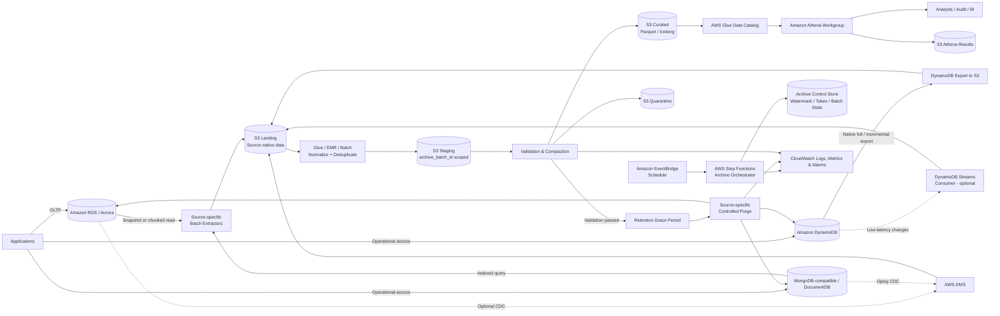

# Solution: Optimize Database Performance & Cost with Multi-Source Data Archival to S3 + Athena

| Thuộc tính | Giá trị |
|---|---|
| Trạng thái | Draft for review |
| Đối tượng | Solution Architect, DBA, Data Engineer, Security, FinOps, Application Team |
| Nguồn dữ liệu | Amazon RDS/Aurora, Amazon DynamoDB, MongoDB-compatible databases, Amazon DocumentDB |
| Đích dữ liệu | Amazon S3, AWS Glue Data Catalog, Amazon Athena |
| Mục tiêu | Giảm dữ liệu “cold” tại source, cải thiện workload vận hành và tối ưu tổng chi phí lưu trữ/truy vấn |

## 1. Executive summary

Giải pháp di chuyển dữ liệu lịch sử ít được truy cập từ nguồn quan hệ và NoSQL — Amazon RDS/Aurora, Amazon DynamoDB, MongoDB-compatible databases và Amazon DocumentDB — sang Amazon S3. Dữ liệu từ các định dạng nguồn được chuẩn hóa thành Apache Parquet hoặc Apache Iceberg, đăng ký trong AWS Glue Data Catalog và truy vấn ad-hoc bằng Amazon Athena.

Kiến trúc khuyến nghị sử dụng **source adapter + batch archival có kiểm soát** cho dữ liệu đã “đóng” và không còn thay đổi. Pipeline chỉ xóa dữ liệu tại source sau khi hoàn tất kiểm tra tính đầy đủ, tính toàn vẹn, khả năng truy vấn và grace period. Mỗi loại source sử dụng cơ chế ingest phù hợp:

- RDS/Aurora: snapshot export để bootstrap, scheduled extraction hoặc AWS DMS CDC.
- DynamoDB: native full/incremental export to S3; DynamoDB Streams khi cần độ trễ thấp hơn.
- MongoDB-compatible/DocumentDB: indexed batch extraction hoặc AWS DMS full load + CDC.

Mọi nguồn đều đi qua landing/staging riêng trước khi được normalize, compact, deduplicate và publish vào curated zone. Cách này giữ pipeline phía Athena nhất quán nhưng không che giấu khác biệt về snapshot boundary, schema, CDC và purge của từng source.

Kết quả kỳ vọng:

- Giảm working set, storage và áp lực I/O tại source khi workload cho phép xóa dữ liệu cũ.
- Giảm kích thước index và thời gian bảo trì trên RDS/MongoDB-compatible databases.
- Giảm lượng item/document cần scan hoặc quản lý trong DynamoDB và MongoDB.
- Cho phép right-size compute, storage hoặc capacity sau khi đo tải thực tế.
- Chuyển dữ liệu lịch sử sang S3 và chỉ trả phí Athena theo lượng dữ liệu quét.
- Duy trì khả năng tra cứu, audit và báo cáo đa nguồn bằng một query layer thống nhất.

> **Lưu ý chi phí quan trọng:** Xóa dữ liệu không tự động tạo savings giống nhau trên mọi source. RDS allocated storage thường không tự thu nhỏ và purge có thể tạo bloat; MongoDB/DocumentDB cần reclaim/compact hoặc right-size theo cơ chế được hỗ trợ; DynamoDB provisioned capacity chỉ giảm chi phí khi capacity được điều chỉnh, trong khi storage giảm theo lượng dữ liệu thực tế. Cost model phải chứng minh savings riêng cho từng source sau khi tính export, CDC, transform và query.

## 2. Bối cảnh và vấn đề

Hệ thống vận hành lâu năm thường lưu cả dữ liệu đang hoạt động và dữ liệu lịch sử trên nhiều loại database. Khi dữ liệu tăng liên tục:

- RDS và MongoDB-compatible sources có index/working set lớn hơn, cache hit có thể giảm và maintenance kéo dài.
- DynamoDB tiếp tục phát sinh storage, backup và chi phí đọc nếu ứng dụng scan/filter trên tập item lớn.
- Backup, CDC retention, snapshot/export và thời gian phục hồi có thể tăng.
- Scale-up compute hoặc capacity giải quyết triệu chứng nhưng không xử lý vòng đời dữ liệu.
- Người dùng vẫn cần dữ liệu cũ cho audit, đối soát hoặc phân tích nhưng không yêu cầu latency như workload vận hành.

S3 và Athena phù hợp với dữ liệu lịch sử vì tách compute khỏi storage, hỗ trợ định dạng columnar và cung cấp query layer chung mà không phải duy trì database server chỉ để phục vụ truy vấn không thường xuyên.

## 3. Mục tiêu và tiêu chí thành công

### 3.1. Mục tiêu

1. Chỉ giữ dữ liệu “hot” cần thiết tại mỗi source theo chính sách retention đã thống nhất.
2. Không làm mất dữ liệu, không tạo bản ghi trùng và duy trì quan hệ/semantics nghiệp vụ cần thiết.
3. Chuẩn hóa dữ liệu quan hệ, item và document để có thể truy vấn bằng Athena.
4. Archival và purge không gây ảnh hưởng đáng kể tới workload production.
5. Có khả năng audit, retry, rollback, legal hold và replay incremental/CDC.
6. Đo được lợi ích hiệu năng và chi phí trước/sau cho từng source.

### 3.2. KPI đề xuất

Baseline cần được đo tối thiểu 2–4 tuần trước khi rollout.

| Nhóm | KPI | Tiêu chí đề xuất |
|---|---|---|
| Data integrity | Chênh lệch row/item/document count | 0 đối với phạm vi archive đã publish |
| Data integrity | Chênh lệch aggregate kiểm soát | 0 đối với sum/min/max/checksum đã chọn |
| Incremental/CDC | Gap hoặc overlap giữa các window | 0 window không được giải thích |
| Reliability | Tỷ lệ job archival thành công | ≥ 99% theo tháng, không tính lỗi dữ liệu đã được quarantine |
| Source impact | CPU/IO/RCU/WCU/replication lag tăng trong job | Không vượt ngưỡng vận hành đã phê duyệt |
| Query | Truy vấn lịch sử chuẩn | Đạt SLA do business xác định |
| Recovery | RPO của archive | Bằng chu kỳ archival hoặc tốt hơn |
| Recovery | RTO truy vấn archive | Theo SLA analytics/audit |
| Cost | Tổng chi phí sau triển khai | Thấp hơn baseline sau khi tính S3, Athena, export, ETL và CDC nếu có |

Các ngưỡng cụ thể phải được xác nhận bằng benchmark thay vì áp dụng máy móc.

## 4. Phạm vi

### 4.1. Trong phạm vi

- Xác định dữ liệu đủ điều kiện archive trong RDS/Aurora, DynamoDB và MongoDB-compatible sources.
- Full export, incremental export, batch extraction hoặc CDC tùy source.
- Chuẩn hóa relational rows, DynamoDB AttributeValue và nested documents.
- Chuyển đổi và lưu dưới dạng Parquet/Iceberg trên S3.
- Quản lý schema bằng Glue Data Catalog.
- Truy vấn dữ liệu lịch sử bằng Athena.
- Kiểm tra dữ liệu, purge an toàn, quan sát và audit.
- S3 lifecycle, encryption, IAM và data retention.
- Đo lường hiệu năng và chi phí theo từng source.

### 4.2. Ngoài phạm vi mặc định

- Thay thế toàn bộ data warehouse hoặc BI platform hiện tại.
- Phục vụ transaction hoặc point lookup latency thấp trực tiếp từ S3.
- Multi-Region disaster recovery, trừ khi được bổ sung thành yêu cầu.
- Đồng bộ hai chiều từ S3 về source database.
- Thay đổi semantics nghiệp vụ của dữ liệu nguồn.

## 5. Giả định cần xác nhận

Thiết kế dùng chung một curated/query layer nhưng giữ source adapter riêng. Trước khi triển khai cần xác nhận:

- Source type, engine/version, deployment model, Region và network path.
- Với RDS/Aurora: engine, primary/replica topology, khóa chính/khóa ngoại và transaction semantics.
- Với DynamoDB: partition/sort key, PITR, export format, Streams, TTL, GSI và capacity mode.
- Với MongoDB-compatible/DocumentDB: replica set/sharding, oplog/change retention, read preference, `_id`, schema variation và nested depth.
- Bảng/collection/item type, khóa nghiệp vụ và cột/attribute thời gian dùng làm retention boundary.
- Dữ liệu lịch sử có immutable thật sự hay vẫn có late update/delete.
- Hot retention, archive retention, legal hold và yêu cầu xóa theo quy định.
- Khối lượng hiện tại, tốc độ tăng trưởng, index/storage và peak load.
- SLA cho workload vận hành và query lịch sử.
- Mức downtime được phép nếu cần physical storage right-sizing.

## 6. Nguyên tắc thiết kế

1. **Archive trước, xác minh sau, purge cuối:** Không xóa dữ liệu nguồn trước khi archive được publish và kiểm tra thành công.
2. **Source-aware ingestion:** Không dùng một extraction strategy cho mọi database; snapshot boundary và CDC token phải phù hợp từng source.
3. **Canonical curated model:** Landing giữ fidelity của nguồn; curated chuẩn hóa kiểu dữ liệu và semantics để query thống nhất.
4. **Immutable curated data:** File đã publish không được sửa tại chỗ; correction tạo version/batch mới có audit trail.
5. **Idempotent pipeline:** Retry cùng một `archive_batch_id` không tạo dữ liệu trùng.
6. **Tách đường ghi và đường đọc:** Landing, staging, curated và Athena query result dùng prefix/bucket riêng.
7. **Least privilege và encryption by default:** Mọi truy cập dùng IAM/database role có phạm vi nhỏ nhất và KMS key phù hợp.
8. **Giảm tác động production:** Ưu tiên native export; nếu phải đọc source thì chunk, throttle và dùng replica/read preference phù hợp.
9. **Partition theo query pattern:** Không partition theo cột có cardinality quá cao nếu điều đó tạo nhiều file nhỏ.
10. **Có thể đo lường:** Mọi batch có source, manifest, watermark/token, count, dung lượng, checksum và trạng thái.

## 7. Kiến trúc mục tiêu



### 7.1. Thành phần

| Thành phần | Trách nhiệm |
|---|---|
| Amazon RDS/Aurora | System of record quan hệ cho dữ liệu hot và giao dịch OLTP |
| Amazon DynamoDB | System of record key-value/document; cung cấp native full/incremental export tới S3 |
| MongoDB-compatible/DocumentDB | System of record dạng document; hỗ trợ indexed batch extraction hoặc DMS |
| Read replica/secondary, nếu có | Giảm tải batch read; phải kiểm soát lag và consistency boundary |
| Amazon EventBridge | Kích hoạt pipeline theo lịch |
| AWS Step Functions | Điều phối source adapter, retry, timeout và state transition |
| DynamoDB Export to S3 | Full/incremental export bất đồng bộ, không tiêu thụ RCU; output DynamoDB JSON hoặc Ion |
| DynamoDB Streams consumer, tùy chọn | Đưa item-level changes vào landing khi incremental export chưa đáp ứng latency |
| AWS DMS, tùy chọn | Full load + CDC cho source được hỗ trợ; MongoDB CDC cần oplog access |
| AWS Glue/EMR/batch worker | Decode source format, normalize nested data, merge changes, ghi Parquet/Iceberg và compact |
| Amazon S3 | Lưu landing, staging, curated, quarantine, manifest và Athena results |
| AWS Glue Data Catalog | Quản lý database/table/schema và partition metadata |
| Amazon Athena | Truy vấn serverless trên dữ liệu archived |
| AWS Lake Formation, tùy chọn | Quản trị quyền table/column/row ở data lake |
| CloudWatch/CloudTrail | Metrics, logs, alarm và audit hoạt động AWS |
| AWS KMS | Mã hóa S3, Glue/Athena results, export và secrets theo yêu cầu |

## 8. Lựa chọn phương án ingest

| Source/phương án | Phù hợp khi | Ưu điểm | Hạn chế | Vai trò đề xuất |
|---|---|---|---|---|
| RDS snapshot export to S3 | Bootstrap RDS snapshot được hỗ trợ | Ít ảnh hưởng DB đang chạy; output Parquet nén và nhất quán | Không phải row-level archival liên tục; không tự purge; phụ thuộc engine/Region | Bootstrap RDS |
| RDS scheduled extraction | Có cutoff rõ ràng và dữ liệu cũ đã đóng | Kiểm soát selection, validation và purge tốt | Tạo tải đọc; cần snapshot/watermark nhất quán | Vận hành định kỳ cho RDS |
| DynamoDB full export to S3 | Bootstrap toàn bộ table tại một point-in-time | Bất đồng bộ, không dùng RCU, không ảnh hưởng table performance | Cần PITR; không filter chỉ item cũ; output JSON/Ion, không phải Parquet | **Bootstrap DynamoDB được khuyến nghị** |
| DynamoDB incremental export | Cần các item insert/update/delete trong một time window | Không dùng RCU; phù hợp scheduled incremental ingest | Chỉ trong PITR window; cần merge/tombstone semantics và window continuity | **Incremental DynamoDB được khuyến nghị** |
| DynamoDB Streams consumer | Cần latency thấp hơn scheduled export | Item-level change stream | Tăng thành phần vận hành; retention/replay và duplicate phải được xử lý | Tùy chọn near-real-time |
| MongoDB indexed batch extraction | Collection có retention key và `_id` ổn định | Filter đúng dữ liệu cần archive; purge dễ đối chiếu | Tạo tải đọc; schema variation; cần keyset pagination | **Mặc định cho immutable MongoDB documents** |
| AWS DMS full load + CDC | RDS/MongoDB/DocumentDB còn update/delete hoặc cần freshness cao | Managed full load/CDC; S3 target hỗ trợ Parquet | Tăng chi phí; file nhỏ; MongoDB CDC cần oplog; phải xử lý purge delete | Tùy chọn cho mutable data |
| Custom application export | Logic nghiệp vụ đặc thù không thể biểu diễn ở ETL | Linh hoạt | Coupling cao, tăng code và rủi ro ảnh hưởng source | Chỉ dùng khi phương án managed không đáp ứng |

### 8.1. Quyết định khuyến nghị theo source

| Source | Bootstrap | Incremental/CDC | Cold-record selection | Controlled purge |
|---|---|---|---|---|
| RDS/Aurora | Snapshot export nếu hỗ trợ | Batch watermark hoặc DMS CDC | Indexed time/status predicate | Partition detach/drop hoặc batched delete theo FK |
| DynamoDB | Native full export | Native incremental export; Streams nếu cần latency thấp | GSI/queue/index item do ứng dụng duy trì; native export không filter cold items | Conditional `DeleteItem`; chỉ dùng `BatchWriteItem` khi không cần version guard; TTL khi semantics cho phép |
| MongoDB-compatible | Indexed full/batch read hoặc DMS full load | Oplog-based DMS CDC | Indexed compound predicate trên status/time/`_id` | Batched delete theo `_id`; TTL index chỉ khi policy phù hợp |
| Amazon DocumentDB | Batch read hoặc DMS | DMS theo khả năng/version được hỗ trợ | Indexed predicate | Batched delete và theo dõi replica/storage behavior |

- Dùng native export trước custom scan khi source cung cấp snapshot không ảnh hưởng production.
- Dữ liệu incremental/CDC luôn đi vào `landing`, sau đó merge/deduplicate trước khi publish curated.
- Tách **historical archive** khỏi **current-state replica**. Source purge là thao tác kỹ thuật, không được diễn giải nhầm thành business delete của dữ liệu lịch sử.
- Chỉ thêm DMS/Streams khi freshness hoặc mutability yêu cầu; không tăng độ phức tạp nếu scheduled batch đủ dùng.

### 8.2. DynamoDB ingestion và archival

#### Full và incremental export

- Bật Point-in-Time Recovery (PITR) trước khi dùng native export.
- Full export tạo snapshot toàn table tại thời điểm đã chọn; không tiêu thụ RCU nhưng không hỗ trợ predicate để chỉ xuất item cũ.
- Incremental export bao phủ item insert/update/delete trong time window thuộc PITR window. Mỗi window phải liên tục, không gap và không overlap chưa được deduplicate.
- Chọn export view phù hợp để giữ new image hoặc cả old/new image khi cần reconstruct change semantics.
- Landing giữ DynamoDB JSON/Ion và export manifest gốc; transform job decode `AttributeValue` như `S`, `N`, `B`, `BOOL`, `NULL`, `M`, `L`, `SS`, `NS`, `BS` sang canonical schema.
- Dữ liệu có schema linh hoạt nên được normalize bằng data contract; unknown attributes có thể giữ trong cột `attributes_json` thay vì tự động thêm vô hạn cột.
- Khi cần current-state table có update/delete, ưu tiên Apache Iceberg `MERGE` hoặc pipeline tương đương; append-only Parquet phù hợp hơn cho immutable history/event log.

#### Chọn và purge cold items

Native export không chọn riêng item theo retention rule. Một trong các pattern sau phải tồn tại:

1. GSI có partition key theo archive state/bucket và sort key theo retention timestamp.
2. Archive queue/index table do application ghi khi item chuyển sang terminal state.
3. Event ledger bất biến, từ đó xác định item đủ điều kiện.

Không dùng table `Scan` định kỳ trên production làm mặc định. Sau validation/grace period:

- Xóa bằng các `DeleteItem` request có condition expression để bảo đảm item chưa thay đổi kể từ lúc archive.
- Chỉ dùng `BatchWriteItem` khi policy chấp nhận không có version condition; reconcile unprocessed items và retry có backoff.
- Theo dõi consumed WCU/throttling dù ingest export không dùng RCU.
- Chỉ dùng TTL nếu việc xóa bất đồng bộ phù hợp SLA và legal hold; TTL không thay thế validation gate.

### 8.3. MongoDB-compatible và DocumentDB ingestion

#### Batch extraction

- Query phải dùng compound index phù hợp, ví dụ `(terminal_status, closed_at, _id)`.
- Dùng keyset pagination theo `(closed_at, _id)`; không dùng `skip` trên collection lớn.
- Chốt high watermark và ghi `_id` range vào manifest.
- Chọn read preference/secondary phù hợp nhưng phải đánh giá replication lag và consistency.
- Giữ raw document ở landing để có thể reprocess; curated flatten có kiểm soát hoặc giữ nested `struct/array` mà Athena hỗ trợ.
- Chuẩn hóa BSON-specific values như `ObjectId`, `Decimal128`, binary, date và timestamp mà không làm mất precision/semantics.

#### DMS CDC

- CDC từ MongoDB-compatible source yêu cầu AWS DMS truy cập được oplog của replica set.
- Oplog phải giữ change lâu hơn thời gian full load, outage và recovery; alarm khi CDC latency tiến gần retention boundary.
- Chọn Document mode khi cần giữ document gần source shape; chọn Table mode khi data contract yêu cầu flatten có giới hạn.
- Xác minh version/topology/network được AWS DMS hỗ trợ trước thiết kế chi tiết, đặc biệt với sharded cluster hoặc managed service ngoài AWS.

#### Purge

- Xóa theo batch `_id`, kèm predicate version/update timestamp để tránh xóa document đã thay đổi sau archive.
- Theo dõi lock, CPU, I/O, replication lag, oplog growth và storage reclaim behavior.
- TTL index chỉ dùng cho expiration semantics đơn giản; legal hold hoặc purge cần thời điểm chính xác phải dùng controlled worker.

### 8.4. Canonical data contract

Mỗi curated record nên có metadata chung:

| Trường | Ý nghĩa |
|---|---|
| `source_system` | ID source ổn định |
| `source_type` | `rds`, `dynamodb`, `mongodb`, `documentdb` |
| `source_entity` | Table hoặc collection |
| `source_key` | Canonical primary/business key; có thể là struct |
| `event_time_utc` | Thời gian nghiệp vụ dùng để query/partition |
| `source_updated_at_utc` | Thời gian update cuối nếu nguồn cung cấp |
| `operation` | Snapshot/insert/update/delete khi có CDC |
| `archive_batch_id` | Batch đã publish record |
| `schema_version` | Version data contract |
| `ingested_at_utc` | Thời gian vào landing |

Metadata không thay thế các cột nghiệp vụ. Với DynamoDB/MongoDB schema linh hoạt, data contract phải quy định thuộc tính bắt buộc, mapping type, unknown-field policy và compatibility rules.

## 9. Chính sách vòng đời dữ liệu

Ví dụ các trạng thái dữ liệu:

| Trạng thái | Vị trí | Đặc tính |
|---|---|---|
| Hot | RDS table, DynamoDB table, MongoDB/DocumentDB collection | Đọc/ghi thường xuyên, latency thấp |
| Cooling | Source, đã qua cutoff nhưng trong grace period | Không hoặc ít thay đổi; chờ archive/validation |
| Landing | S3 source-specific prefix | Snapshot/export/CDC ở định dạng gần nguồn, chưa dành cho consumer |
| Archived | S3 curated | Parquet/Iceberg, truy vấn qua Athena |
| Deep archive | S3 storage class theo lifecycle | Truy cập rất hiếm; có thời gian restore và phí retrieval |
| Expired | Đã xóa theo policy | Xóa có audit, trừ legal hold |

Policy phải được cấu hình theo source/entity vì retention và purge semantics khác nhau:

```yaml
source_system: <source-id>
source_type: <rds|dynamodb|mongodb|documentdb>
source_entity: <table-or-collection>
hot_retention_days: <business-defined>
archive_schedule: <cron-expression>
grace_period_days: <business-defined>
archive_retention_years: <compliance-defined>
legal_hold_enabled: true
ingest_mode: <snapshot|batch|incremental-export|cdc>
purge_mode: <partition-drop|batched-delete|conditional-delete|ttl>
```

Không dùng ingestion time làm tiêu chí duy nhất nếu retention nghiệp vụ dựa trên `event_time`, `closed_at`, `settled_at` hoặc terminal state. TTL của DynamoDB/MongoDB chỉ là cơ chế thực thi expiration, không tự xác định record đã đủ điều kiện archive.

## 10. Luồng archival chi tiết

### 10.1. Xác định phạm vi batch

1. Tính `cutoff_time` từ policy của source/entity.
2. Chỉ chọn record/item/document đã ở terminal state nếu nghiệp vụ yêu cầu.
3. Chốt source boundary: transaction/key watermark cho RDS, export time/window cho DynamoDB, `(event_time, _id)` hoặc oplog token cho MongoDB.
4. Ghi control record với `source_system`, `source_entity`, `archive_batch_id`, cutoff, watermark/token và trạng thái `PLANNED`.
5. Không cho hai batch xử lý chồng cùng phạm vi, trừ khi merge layer có deduplication key rõ ràng.

Nếu entity không có stable key hoặc retention attribute đáng tin cậy, phải sửa data model/data contract trước khi tự động purge. Với DynamoDB, partition/sort key phải được canonicalize đầy đủ; với MongoDB, `_id` không được mất type khi chuyển đổi.

### 10.2. Extract/export

| Source | Cách tạo boundary và đọc dữ liệu |
|---|---|
| RDS/Aurora | Snapshot export hoặc chunk theo primary key/cặp `(event_time, primary_key)`; ưu tiên replica nếu consistency cho phép |
| DynamoDB | Native full export theo point-in-time hoặc incremental export theo time window; giữ manifest và export ARN |
| MongoDB/DocumentDB | Indexed keyset pagination theo `(event_time, _id)` hoặc DMS full load/CDC; giữ oplog/resume position khi có |

Quy tắc chung:

- Ưu tiên export/snapshot do service quản lý để giảm tải source.
- Nếu phải query source, đọc theo chunk có thứ tự ổn định và giới hạn concurrency/bandwidth.
- Không dùng `OFFSET`, MongoDB `skip` hoặc DynamoDB table `Scan` làm chiến lược mặc định cho dataset lớn.
- Ghi dữ liệu vào landing/staging prefix gắn với source và batch ID.
- Lưu source count, key range, export/CDC window và các aggregate kiểm soát.
- Không tiến watermark/token nếu batch chưa durable ở landing và control store.

### 10.3. Transform và publish

- Giữ source-native payload và manifest trong landing để có thể reprocess.
- Decode DynamoDB AttributeValue và BSON-specific types theo data contract.
- Chuẩn hóa timestamp về UTC nhưng lưu timezone/source semantics trong metadata.
- Giữ precision của decimal/Decimal128; không ép dữ liệu tài chính sang floating point.
- Quy định cách biểu diễn nested map/document, list/array, sets, binary và null/missing field.
- Chuyển dữ liệu sang Parquet; dùng Iceberg khi cần merge/upsert/delete semantics ở curated layer.
- Compact file nhỏ; kích thước file mục tiêu ban đầu thường khoảng 128–512 MiB, sau đó điều chỉnh theo query pattern.
- Deduplicate bằng source key + source version/change position, không chỉ bằng ingestion time.
- Ghi manifest và validation result.
- Chỉ publish prefix/table snapshot curated sau khi toàn bộ validation thành công.
- Cập nhật Glue table/partition hoặc dùng Athena partition projection.

S3 không hỗ trợ rename transaction theo kiểu filesystem. “Publish” phải được biểu diễn bằng trạng thái trong control table/manifest hoặc commit atomic của table format; consumer chỉ đọc batch/snapshot có trạng thái `PUBLISHED`.

### 10.4. Validation gate

Validation tối thiểu:

- Row/item/document count nguồn và archive bằng nhau trong cùng snapshot boundary.
- Không trùng canonical source key trong batch và giữa các batch đã publish, trừ version history có chủ đích.
- So sánh min/max timestamp, min/max key và watermark/export/CDC window.
- So sánh aggregate nghiệp vụ như tổng amount, count theo status/currency/date.
- Kiểm tra schema, nested field policy, null so với missing, decimal precision, binary và timezone.
- Với DynamoDB incremental export: xác nhận window continuity và xử lý insert/update/delete image đúng semantics.
- Với MongoDB CDC: xác nhận không vượt oplog retention và change position đã durable.
- Chạy query smoke test trên Athena.
- Xác nhận file không rỗng, có thể đọc và dùng đúng KMS key/prefix.

Nếu bất kỳ kiểm tra bắt buộc nào thất bại:

1. Chuyển batch sang `VALIDATION_FAILED`.
2. Không purge source và không tiến watermark/token.
3. Đưa record/file lỗi vào quarantine.
4. Phát alarm kèm source, entity, batch ID và phạm vi dữ liệu.
5. Retry sau khi nguyên nhân được xử lý; không publish chồng dữ liệu.

### 10.5. Grace period và purge

Sau khi archive đã publish:

1. Chờ grace period đã phê duyệt.
2. Kiểm tra legal hold, batch vẫn hợp lệ và source record chưa thay đổi sau boundary.
3. Tạo immutable purge manifest chứa canonical keys/version cần xóa.
4. Purge bằng source adapter với batch nhỏ và conditional/version checks.
5. Tự động pause khi source health, throttling hoặc replication lag vượt ngưỡng.
6. Ghi số record đã xóa, record bị condition conflict và reconcile với manifest.
7. Chạy maintenance/reclaim/right-sizing phù hợp với source.

| Source | Purge strategy | Guardrail chính |
|---|---|---|
| RDS/Aurora | Child-to-parent batched delete; ưu tiên detach/drop native partition | Commit ngắn; theo dõi lock, WAL/binlog/undo và replica lag |
| DynamoDB | Conditional `DeleteItem` với bounded concurrency; `BatchWriteItem` chỉ khi không cần version guard | Condition expression theo version; retry throttled/unprocessed operations; WCU limit |
| MongoDB/DocumentDB | Batched delete theo `_id` và version/update predicate | Indexed filter; write concern; replication lag/oplog và storage behavior |
| TTL-based source | Set expiration chỉ sau validation/grace period | Chấp nhận xóa bất đồng bộ; legal hold phải ngăn set/expire TTL |

Nếu bảng RDS được partition native theo retention key, ưu tiên detach/drop partition sau khi archive và validate. Với DynamoDB hoặc MongoDB, TTL chỉ dùng khi thời điểm xóa không cần chính xác và semantics pháp lý cho phép; TTL không thay controlled validation/purge policy.

### 10.6. State machine

```text
PLANNED
  -> INGESTING
  -> INGESTED
  -> VALIDATING
  -> PUBLISHED
  -> GRACE_PERIOD
  -> PURGING
  -> COMPLETED

Bất kỳ bước trước PURGING:
  -> FAILED / VALIDATION_FAILED
  -> retry cùng archive_batch_id

Trong hoặc sau PURGING:
  -> PURGE_PARTIAL
  -> reconcile và tiếp tục từ purge watermark
```

## 11. Thiết kế S3 data lake

### 11.1. Tách vùng dữ liệu

```text
s3://<archive-bucket>/
  landing/
    source_type=<type>/source_system=<source>/entity=<table-or-collection>/...
  staging/
    source_system=<source>/archive_batch_id=<batch-id>/...
  curated/
    source_system=<source>/domain=<domain>/entity=<entity>/event_year=YYYY/event_month=MM/...
  quarantine/
    source_system=<source>/archive_batch_id=<batch-id>/reason=<reason>/...
  manifests/
    source_system=<source>/entity=<entity>/archive_batch_id=<batch-id>/manifest.json

s3://<athena-results-bucket>/
  workgroup=<workgroup>/...
```

Landing phải tách prefix theo source type vì RDS snapshot/DMS, DynamoDB JSON/Ion và MongoDB document có format/manifest khác nhau. Có thể tách bucket theo account, environment hoặc data classification thay vì chỉ dùng prefix. Không đưa dữ liệu production và non-production vào cùng security boundary.

### 11.2. Partition strategy

Khuyến nghị mặc định:

- Partition theo event date ở mức `year/month` hoặc `year/month/day` tùy volume.
- Thêm partition có cardinality thấp chỉ khi hầu hết query luôn filter theo cột đó.
- Không partition trực tiếp theo customer ID/order ID có cardinality cao.
- Mỗi query Athena phải có predicate thời gian khi có thể.
- Dùng partition projection khi partition có quy luật dự đoán được để giảm thao tác đăng ký partition.

Ví dụ:

```text
curated/source_system=crm/domain=sales/entity=orders/event_year=2026/event_month=07/part-00001.parquet
```

### 11.3. File format và small-file management

- Parquet là định dạng mặc định vì columnar, hỗ trợ predicate pushdown và chỉ đọc các cột cần thiết.
- Theo dõi số lượng file và kích thước trung vị.
- DMS/CDC hoặc batch nhỏ có thể tạo nhiều file nhỏ; chạy compaction trước khi publish curated.
- Không compact xuyên qua retention boundary nếu việc đó làm purge/lifecycle khó kiểm soát.

### 11.4. Schema evolution

- Add nullable column: cho phép sau khi đánh giá consumer.
- Rename/drop/change type: tạo schema version mới hoặc compatibility view.
- Không tự động chấp nhận schema drift vào curated.
- Manifest phải ghi schema version và source database version.
- Glue crawler có thể hỗ trợ discovery ở landing nhưng curated schema nên được quản lý bằng Infrastructure as Code hoặc migration có review.

## 12. Thiết kế Athena

### 12.1. Workgroup

Tạo workgroup riêng cho archive với:

- S3 query result location riêng.
- SSE-KMS encryption.
- Per-query/per-workgroup data scan controls phù hợp.
- CloudWatch metrics và cost allocation tags.
- IAM/Lake Formation permissions theo persona.

### 12.2. Table mẫu với partition projection

DDL dưới đây là template, cần thay schema và cột theo dữ liệu thật:

```sql
CREATE EXTERNAL TABLE archive_db.orders (
    order_id           string,
    customer_id        string,
    status             string,
    amount              decimal(18, 2),
    currency            string,
    created_at_utc      timestamp,
    closed_at_utc       timestamp,
    archive_batch_id    string
)
PARTITIONED BY (
    event_year  string,
    event_month string
)
STORED AS PARQUET
LOCATION 's3://<archive-bucket>/curated/source_system=crm/domain=sales/entity=orders/'
TBLPROPERTIES (
    'projection.enabled' = 'true',
    'projection.event_year.type' = 'integer',
    'projection.event_year.range' = '<start-year>,<end-year>',
    'projection.event_year.digits' = '4',
    'projection.event_month.type' = 'integer',
    'projection.event_month.range' = '1,12',
    'projection.event_month.digits' = '2',
    'storage.location.template' = 's3://<archive-bucket>/curated/source_system=crm/domain=sales/entity=orders/event_year=${event_year}/event_month=${event_month}/'
);
```

Query nên giới hạn partition và cột:

```sql
SELECT order_id, status, amount, currency, closed_at_utc
FROM archive_db.orders
WHERE event_year = '2026'
  AND event_month BETWEEN '01' AND '03'
  AND customer_id = '<customer-id>';
```

### 12.3. Truy cập hợp nhất hot + cold

Không khuyến nghị thay workload vận hành bằng Athena. Có ba lựa chọn:

1. **Application routing:** Ứng dụng quyết định query source operational hay archive dựa trên thời gian. Đây là lựa chọn rõ ràng và dễ kiểm soát nhất.
2. **Reporting layer:** BI/report service query read replica/API operational cho hot data và Athena cho cold data, sau đó hợp nhất kết quả.
3. **Athena federated query:** Chỉ cân nhắc khi cần một SQL endpoint hợp nhất và có connector được hỗ trợ cho source; phải benchmark Lambda connector, network, Secrets Manager/IAM, chi phí và ảnh hưởng source.

Không cố union các entity chỉ vì chúng có tên trường giống nhau. Unified view chỉ được tạo khi canonical data contract chứng minh cùng business semantics giữa RDS row, DynamoDB item và MongoDB document.

## 13. Control metadata và idempotency

Control store có thể là DynamoDB hoặc một datastore quản trị độc lập, miễn không tạo dependency vòng khiến source outage làm mất khả năng điều phối hay recovery. Nếu DynamoDB vừa là source vừa là control store, phải dùng table/account boundary riêng và không đưa control items vào retention pipeline.

Metadata tối thiểu cho mỗi batch:

| Trường | Ý nghĩa |
|---|---|
| `archive_batch_id` | ID duy nhất, ổn định qua retry |
| `source_system/source_type` | Source ID và loại RDS/DynamoDB/MongoDB/DocumentDB |
| `source_entity` | Table hoặc collection nguồn |
| `cutoff_time` | Retention boundary |
| `low_watermark/high_watermark` | Phạm vi key/time của batch |
| `export_arn/export_window` | DynamoDB/RDS export identity và window khi có |
| `cdc_position` | DMS checkpoint, oplog/change position hoặc stream position khi có |
| `schema_version` | Version canonical schema curated |
| `source_record_count` | Số row/item/document trong boundary |
| `archive_record_count` | Số record đọc được từ curated |
| `control_totals` | Aggregate/checksum nghiệp vụ |
| `s3_prefix` | Prefix hoặc table snapshot đã publish |
| `status` | Trạng thái state machine |
| `legal_hold` | Cờ chặn purge/expiry |
| `created_at/updated_at` | Audit timestamp |
| `purged_record_count` | Số record đã xóa nguồn |
| `purge_conflict_count` | Record không xóa vì đã thay đổi sau boundary |

Idempotency key nên dựa trên source, entity và watermark/export/CDC range, không dựa duy nhất vào thời điểm chạy job.

## 14. Security và compliance

### 14.1. Data protection

- Bật S3 Block Public Access ở account và bucket.
- Bắt buộc TLS bằng bucket policy.
- Mã hóa S3 bằng SSE-KMS; tách key theo security boundary khi cần.
- Mã hóa RDS/Aurora, DynamoDB, MongoDB/DocumentDB, snapshots/exports, Glue jobs và Athena query results theo khả năng từng service.
- Dùng Secrets Manager cho database credential; không ghi secret vào job arguments/logs.
- Mask/tokenize PII trước khi publish nếu archive consumer không cần dữ liệu gốc.
- Cấu hình lifecycle riêng cho Athena query results vì chúng có thể chứa dữ liệu nhạy cảm.

### 14.2. Access control

- Role export DynamoDB chỉ có `ExportTableToPointInTime` trên table được phê duyệt và quyền ghi prefix landing tương ứng.
- Role extract RDS/MongoDB chỉ được đọc table/collection cần archive và ghi landing/staging prefix.
- Database user MongoDB/DMS phải có privilege tối thiểu; oplog access chỉ cấp khi CDC thực sự cần.
- Role publish được đọc landing/staging, ghi curated/manifest; không có quyền purge source.
- Role purge tách theo source và chỉ được xóa entity đủ điều kiện sau validation gate.
- Athena analyst chỉ được đọc curated table/column được cấp quyền.
- Dùng Lake Formation nếu cần quản trị table/column/row tập trung.
- Tách nhiệm vụ export, publish và purge để giảm blast radius.

### 14.3. Network và audit

- Chạy Glue/DMS/batch worker trong VPC khi cần truy cập private RDS, DocumentDB hoặc MongoDB endpoint.
- Với MongoDB managed ngoài AWS, dùng private connectivity/VPN/peering khi khả thi; giới hạn allowlist và không gửi dữ liệu qua endpoint không được phê duyệt.
- Dùng security group tối thiểu và VPC endpoints cho S3/DynamoDB/Glue/Secrets Manager/KMS khi phù hợp.
- Dùng Secrets Manager cho RDS/MongoDB credentials; DynamoDB truy cập bằng IAM role, không dùng static access key.
- Bật CloudTrail data events cho các prefix nhạy cảm theo yêu cầu audit và cân nhắc chi phí log.
- Audit DynamoDB export requests, DMS task changes, KMS usage, bucket policy changes và truy cập bất thường.
- S3 Object Lock chỉ bật khi có yêu cầu WORM rõ ràng vì ảnh hưởng trực tiếp tới khả năng xóa và chi phí.

## 15. Reliability, backup và disaster recovery

- S3 curated không thay thế backup/PITR/snapshot và CDC recovery của source operational.
- Bật S3 Versioning nếu phù hợp với recovery model; kết hợp lifecycle cho noncurrent versions.
- Cân nhắc Cross-Region Replication chỉ khi RTO/RPO và data residency yêu cầu.
- Manifest/control metadata cần được backup và có khả năng rebuild từ S3 inventory/file metadata.
- Kiểm thử định kỳ khả năng đọc Parquet, recreate Glue table và chạy query từ một môi trường recovery.
- Batch chỉ được xem là hoàn tất khi dữ liệu có thể truy vấn, không chỉ khi file đã tồn tại.

## 16. Observability và vận hành

### 16.1. Metrics

**Pipeline**

- Batch duration và trạng thái.
- Records/bytes ingested, published, quarantined và purged theo source.
- Throughput, retry count và age of last successful archive.
- Validation mismatch count.
- File count, median file size và small-file ratio.

**Source databases**

- RDS/Aurora: CPU, memory, connections, IOPS/latency, free storage, replica lag, WAL/binlog/undo, locks và bloat.
- DynamoDB: export status/duration, table size/item count, consumed RCU/WCU, throttled requests, Streams iterator age và PITR status.
- MongoDB/DocumentDB: CPU, memory/cache, connections, read/write latency, replication lag, oplog window, cursor/query duration và storage.
- Với mọi source: archive candidate backlog, purge conflict count và age of oldest unarchived record.

**Athena/S3**

- Data scanned per query/workgroup.
- Query runtime, failure/throttle count.
- S3 storage theo prefix/storage class, request count và lifecycle transition.

### 16.2. Alarms

Alarm tối thiểu:

- Không có batch thành công quá một chu kỳ cho phép.
- Validation mismatch khác 0 hoặc incremental/CDC window có gap.
- Purge chạy khi batch chưa `PUBLISHED`, còn legal hold hoặc source version đã thay đổi.
- RDS/MongoDB CPU, I/O, lock hoặc replication lag vượt ngưỡng trong extract/purge.
- DynamoDB export failure, PITR disabled, WCU throttling hoặc Streams iterator age vượt ngưỡng.
- MongoDB oplog window nhỏ hơn thời gian cần để CDC recover.
- Athena scan vượt budget.
- KMS access denied, S3 write/read denied hoặc Glue schema mismatch.

Mỗi log phải có `source_system`, `source_entity`, `archive_batch_id`, watermark/export window/CDC position và correlation ID; không log dữ liệu nhạy cảm.

## 17. Tối ưu hiệu năng

### 17.1. RDS

- Archive theo bảng có mức tăng trưởng và read amplification cao nhất trước.
- Rebuild/reorganize index hoặc vacuum phù hợp với engine sau purge, trong maintenance window.
- Update statistics sau thay đổi lớn.
- Dùng native partitioning cho các bảng rất lớn nếu workload và engine phù hợp.
- Không chạy extract/purge concurrency cao mà chưa load test.
- Đo p50/p95/p99 latency của top SQL trước và sau archive bằng Performance Insights/engine statistics.

### 17.2. DynamoDB và MongoDB-compatible

**DynamoDB**

- Dùng native export thay vì Scan để bootstrap/incremental ingest.
- Thiết kế GSI/archive queue để chọn cold items mà không scan toàn table.
- Giới hạn purge throughput và xử lý unprocessed items với backoff.
- Chỉ giảm provisioned capacity sau khi workload metrics chứng minh an toàn.

**MongoDB/DocumentDB**

- Tạo index phục vụ retention predicate trước pilot và xác nhận bằng query plan.
- Dùng keyset pagination, projection chỉ lấy field cần thiết và batch size đã benchmark.
- Throttle purge theo replication lag/oplog window; đánh giá compact/reclaim theo engine.
- Theo dõi schema variation và document size để tránh transform skew.

### 17.3. Athena

- Chỉ select cột cần thiết; tránh `SELECT *` trong workload lặp lại.
- Luôn filter partition khi có thể.
- Compact file nhỏ và dùng Parquet.
- Tạo bảng aggregate/materialized dataset cho báo cáo lặp lại thay vì quét raw history.
- Dùng workgroup scan limit và cost allocation tags.
- Theo dõi query có scan lớn nhưng trả ít row để tối ưu partition/data layout.

## 18. Mô hình chi phí

Không hard-code bảng giá vì giá phụ thuộc Region và có thể thay đổi. Sử dụng AWS Pricing Calculator và Cost Explorer với số liệu thực tế.

### 18.1. Baseline

```text
Current monthly cost =
    RDS/Aurora compute + storage + IOPS + backup
  + DynamoDB storage + read/write capacity + PITR/backup
  + MongoDB/DocumentDB compute + storage + I/O + backup
  + data transfer
  + operational overhead
```

### 18.2. Target

```text
Target monthly cost =
    right-sized source compute, capacity and storage
  + native export and incremental export charges
  + S3 storage by storage class
  + S3 requests and lifecycle/retrieval charges
  + Athena bytes scanned
  + Glue/EMR/Step Functions/EventBridge
  + DMS or Streams consumers, if enabled
  + KMS, logging and data transfer
  + operational overhead
```

```text
Net saving = Current monthly cost - Target monthly cost - one-time migration cost
Payback period = One-time migration cost / Monthly net saving
```

### 18.3. Điều kiện để hiện thực hóa savings

- RDS working set/index giảm đủ để hạ instance class hoặc số read replica; allocated storage có thể cần migration để right-size.
- DynamoDB item storage giảm; provisioned capacity chỉ giảm chi phí khi được điều chỉnh, còn on-demand cost phụ thuộc request thực tế.
- MongoDB/DocumentDB compute/storage được reclaim hoặc right-size theo khả năng nền tảng.
- Backup retention, PITR, oplog/change retention và snapshot cũ được quản lý đúng policy.
- DynamoDB full/incremental export, DMS, Streams, transform và compaction cost được đưa vào forecast.
- Athena scan được kiểm soát bằng Parquet/Iceberg, partitioning và workgroup limits.
- Không chuyển dữ liệu sang lớp S3 có retrieval cost/latency không phù hợp với tần suất truy cập.

## 19. Kế hoạch triển khai

### Giai đoạn 0 — Discovery và baseline

- Inventory source, table/collection, key model, size, growth, index/GSI và top workload.
- Phân loại hot/warm/cold và tần suất truy cập.
- Xác nhận retention, legal hold, PII, mutability và freshness SLA.
- Đo chi phí, capacity/compute, I/O, latency, backup/PITR, replication và maintenance.
- Chọn một entity pilot cho mỗi source type cần onboard, bắt đầu với source ít rủi ro.

**Exit criteria:** Có owner, cutoff rule, source boundary, baseline, data contract và phê duyệt Security/Compliance.

### Giai đoạn 1 — Foundation

- Tạo S3 buckets/prefix, KMS keys, bucket policy và lifecycle.
- Tạo IAM/database roles, Glue database/table, Athena workgroup và result bucket.
- Tạo source adapters, control store, state machine, logging và alarms.
- Triển khai bằng Infrastructure as Code.

**Exit criteria:** Security review pass; có thể ghi/normalize/đọc test dataset từ mỗi source type end-to-end.

### Giai đoạn 2 — Pilot không purge

- Chạy full/batch/incremental ingest cho một phạm vi nhỏ.
- Validate source-native type mapping và benchmark Athena.
- Re-run cùng batch hoặc overlapping window để chứng minh idempotency.
- Fault injection ở bước export/extract, normalize, publish và catalog/table commit.
- Chưa xóa dữ liệu tại source.

**Exit criteria:** Validation đạt, retry không trùng dữ liệu, không có window gap và query đáp ứng SLA.

### Giai đoạn 3 — Shadow production và purge có kiểm soát

- Archive production nhưng giữ grace period dài.
- Business/UAT xác nhận truy vấn lịch sử.
- Purge canary theo source-specific batch nhỏ.
- Theo dõi RDS/MongoDB replication và latency, DynamoDB throttling/capacity và application latency; có auto-pause.

**Exit criteria:** Không có data loss, không vi phạm workload SLO, conditional conflicts được giải thích và reconciliation hoàn tất.

### Giai đoạn 4 — Scale-out và right-sizing

- Mở rộng từng source/entity theo risk tier.
- Tối ưu compaction/partitioning/merge theo metrics Athena.
- Reclaim storage hoặc giảm capacity theo cơ chế từng source.
- Benchmark và right-size compute, storage, IOPS/throughput hoặc provisioned capacity.
- Cập nhật cost forecast và runbook.

**Exit criteria:** KPI và savings được xác nhận theo source bằng dữ liệu ít nhất một chu kỳ billing phù hợp.

## 20. Rollback và xử lý sự cố

### 20.1. Trước purge

Rollback đơn giản:

- Dừng schedule.
- Đánh dấu batch lỗi/deprecated.
- Xóa staging hoặc curated batch chưa được consumer chấp nhận theo policy.
- Retry từ watermark/export window/CDC position cũ.

### 20.2. Sau purge

Không coi việc load ngược tự động là rollback mặc định. Quy trình khôi phục phải được thiết kế và kiểm thử theo source:

1. Dừng các batch tiếp theo.
2. Xác định chính xác source, entity, `archive_batch_id` và phạm vi bị ảnh hưởng.
3. Query dữ liệu từ curated và đối chiếu landing payload nếu cần source-native types.
4. Nạp vào staging/recovery store, không ghi thẳng production khi chưa kiểm tra conflict.
5. Validate key, relationship/reference và conflict với dữ liệu mới.
6. Khôi phục có điều kiện: RDS merge trong transaction/batch, DynamoDB conditional put, MongoDB insert/replace theo `_id` và version.
7. Reconcile, ghi audit và chỉ resume pipeline sau phê duyệt.

Với sự cố diện rộng, dùng cơ chế recovery của source: RDS PITR, DynamoDB PITR restore sang table mới hoặc MongoDB/DocumentDB snapshot restore; sau đó reconcile với thay đổi phát sinh sau restore point.

## 21. Rủi ro và biện pháp giảm thiểu

| Rủi ro | Tác động | Biện pháp |
|---|---|---|
| Xóa dữ liệu trước khi archive hợp lệ | Data loss | Validation gate, grace period, tách role publish/purge |
| Late update/delete sau cutoff | Archive sai trạng thái | Chỉ archive terminal records; CDC/correction batch nếu cần |
| Snapshot không nhất quán giữa chunks | Count/aggregate lệch | Chốt watermark; consistent snapshot khi khả thi; validation bắt buộc |
| Extract/purge gây tải production | Vi phạm workload SLO | Native export, replica/secondary, off-peak, throttling, small batches, auto-pause |
| Nhiều file nhỏ | Athena chậm và tăng request cost | Compaction trước curated, theo dõi file metrics |
| Partition quá chi tiết | Metadata/file explosion | Partition theo query pattern và cardinality thấp |
| Schema drift | Query sai hoặc job fail | Versioned schema, compatibility checks, quarantine |
| Athena scan không kiểm soát | Chi phí tăng | Parquet, partition filters, workgroup limits, budget alarm |
| Xóa row nhưng RDS bill không giảm | Không đạt mục tiêu cost | Reclaim space, benchmark và migration/right-sizing plan |
| DMS ghi nhận purge như business delete | Mất semantics archive | Landing/curated tách biệt; quản lý CDC delete và purge event riêng |
| DynamoDB incremental window có gap | Thiếu update/delete | Lưu export window; overlap có dedupe; alarm trước khi ra ngoài PITR window |
| DynamoDB export bị hiểu là cold-item filter | Purge item chưa archive đúng phạm vi | Dùng GSI/archive queue để lập purge manifest; export chỉ cung cấp snapshot/change input |
| DynamoDB AttributeValue mapping sai | Mất type/precision | Contract test cho number, set, map/list, binary, null/missing |
| MongoDB oplog hết trước khi CDC bắt kịp | Mất changes | Sizing/monitor oplog window; alarm CDC lag; re-bootstrap có runbook |
| MongoDB schema variation/nested depth | Transform fail hoặc schema bùng nổ | Raw landing, explicit schema contract, unknown-field policy, quarantine |
| Conditional purge conflict | Xóa nhầm bản ghi đã thay đổi hoặc backlog tăng | Version predicate; không force delete; correction/re-archive workflow |
| S3 lifecycle chuyển lớp quá sớm | Retrieval chậm/tốn phí | Phân tích access pattern và thời gian lưu tối thiểu của storage class |
| PII tồn tại lâu hơn policy | Compliance breach | Retention engine, legal hold rõ ràng, delete audit, tokenization |

## 22. Kiểm thử và tiêu chí nghiệm thu

### 22.1. Functional tests

- Archive đúng cutoff và terminal status cho từng source.
- Không archive record ngoài boundary.
- Retry/overlapping incremental window không tạo duplicate.
- DynamoDB JSON/Ion mapping giữ đúng number, binary, set, map/list, null và missing semantics.
- MongoDB mapping giữ đúng `_id`, Decimal128, date, binary, nested document và array.
- Schema, decimal và timestamp giữ đúng semantics từ source tới Athena.
- Insert/update/delete từ incremental/CDC tạo đúng historical hoặc current-state result theo data contract.
- Athena query trả đúng kết quả đối chiếu với source snapshot.
- Legal hold chặn purge và lifecycle expiry.

### 22.2. Failure tests

- Mất kết nối source giữa chunk.
- DynamoDB export thất bại, incremental window overlap/gap hoặc unprocessed purge item.
- MongoDB oplog CDC lag vượt warning threshold.
- Glue/EMR/batch worker timeout.
- S3/KMS access denied.
- Một file Parquet hoặc source-native landing file lỗi.
- Glue catalog/table commit thất bại sau khi file đã ghi.
- Validation mismatch.
- Purge bị dừng giữa chừng hoặc conditional delete conflict.

### 22.3. Performance tests

- Đo tải extract tối đa không vi phạm source SLO.
- Xác nhận DynamoDB native export không tiêu thụ RCU; benchmark transform và purge WCU/throttling riêng.
- Xác nhận MongoDB retention query dùng đúng index và không làm CDC/oplog tụt khỏi safety window.
- Đo batch purge size/concurrency an toàn cho từng source.
- So sánh top workload p95/p99 trước và sau archive.
- Đo Athena runtime và bytes scanned trên query đại diện.
- Đo compaction/merge duration và cost cho Parquet/Iceberg.

### 22.4. Acceptance criteria

Giải pháp chỉ được chuyển sang vận hành đầy đủ khi:

- Tất cả validation bắt buộc đạt và không có record/window gap không giải thích được.
- Có runbook retry, pause, purge partial, CDC re-bootstrap và source-specific restore.
- Security/Compliance phê duyệt IAM/database privileges, encryption, retention và legal hold.
- Production canary không vi phạm source/workload SLO.
- Dashboard và alarms hoạt động cho từng source adapter.
- Business owner xác nhận query lịch sử đáp ứng nhu cầu.
- FinOps xác nhận cost model bao gồm export/CDC/transform/query và kế hoạch right-sizing từng source.

## 23. Infrastructure as Code inventory

Các resource dự kiến:

- S3 archive bucket và Athena results bucket.
- S3 bucket policy, lifecycle, versioning và encryption configuration.
- KMS keys/aliases và key policies.
- IAM roles/policies cho orchestration, extract, publish, purge và query.
- EventBridge schedule.
- Step Functions state machine.
- Glue jobs, connections, database và tables.
- Athena workgroup và named queries tùy chọn.
- DynamoDB control table, nếu chọn.
- DynamoDB PITR/export permissions, export orchestration và Streams/Lambda/Firehose resources nếu chọn.
- MongoDB/DocumentDB connections, Secrets Manager secrets và network controls.
- DMS replication instance/serverless configuration, endpoints và tasks cho RDS/MongoDB/DocumentDB nếu chọn.
- Source-specific purge roles, policies và throttling configuration.
- CloudWatch log groups, metrics filters, dashboards và alarms.
- SNS/incident integration.
- Lake Formation grants, nếu chọn.

Mọi resource phải có tags tối thiểu cho application, environment, owner, data classification và cost center.

## 24. Runbook vận hành rút gọn

### Khi archival batch thất bại

1. Kiểm tra batch ID, state cuối và alarm context.
2. Xác định lỗi transient, schema/data quality hay permission.
3. Không thay watermark/export window/CDC position thủ công khi chưa reconcile.
4. Sửa nguyên nhân và retry cùng batch ID.
5. Xác nhận không có curated duplicate.

### Khi validation thất bại

1. Dừng purge cho dataset.
2. So sánh manifest, source boundary và Athena result.
3. Quarantine record/file lỗi.
4. Nếu source đã thay đổi sau extract, tạo lại snapshot boundary hợp lệ.
5. Chỉ publish khi toàn bộ check bắt buộc pass.

### Khi source database bị ảnh hưởng

1. Auto-pause extract/purge cho source tương ứng.
2. RDS/MongoDB: hủy query/transaction archival gây lock theo runbook DBA; chờ replication/resource metrics phục hồi.
3. DynamoDB: giảm purge concurrency, xử lý unprocessed items và chờ throttling phục hồi; native export không cần giảm RCU.
4. MongoDB CDC: ưu tiên giữ oplog continuity; nếu checkpoint đã ra ngoài oplog window thì dừng publish và re-bootstrap theo runbook.
5. Giảm chunk size/concurrency trước khi resume.
6. Mở incident nếu workload SLO bị vi phạm.

## 25. Các quyết định còn mở

| Quyết định | Owner | Dữ liệu cần có |
|---|---|---|
| Source/entity nào được onboard | Architecture + Data Owner | Inventory, classification, volume, owner |
| Hot retention cho từng table/collection/item type | Business + Compliance | Access pattern, regulation |
| Canonical schema và unknown-field policy | Data Team + Consumer | RDS types, DynamoDB attributes, MongoDB documents |
| DynamoDB full/incremental export hay Streams | Architect + Data Team | Freshness SLA, PITR, change volume |
| MongoDB batch hay DMS CDC | Architect + DBA | Mutability, oplog window, supported topology |
| Parquet append-only hay Iceberg merge | Data Team | Update/delete semantics và query engine requirements |
| Glue, EMR hay batch worker khác | Platform Team | Volume, transformations, skills, cost |
| Partition keys | Data Team | Query patterns và volume/ngày |
| S3 storage classes/lifecycle | FinOps + Compliance | Access frequency, retention, restore SLA |
| Control store | Platform Team | Availability và dependency constraints |
| Cách reclaim/right-size từng source | DBA + FinOps | Engine/service limits, storage layout, capacity mode, downtime budget |
| Unified hot/cold access | Application + Data Team | UX/SLA và query patterns |
| Multi-Region replication | Risk/Compliance | RTO/RPO và residency |

## 26. Tài liệu tham khảo AWS

### RDS, S3 và Athena

- [Archiving data in Amazon RDS for MySQL, Amazon RDS for MariaDB, and Aurora MySQL-Compatible](https://docs.aws.amazon.com/prescriptive-guidance/latest/archiving-mysql-data/introduction.html)
- [Exporting DB snapshot data to Amazon S3 for Amazon RDS](https://docs.aws.amazon.com/AmazonRDS/latest/UserGuide/USER_ExportSnapshot.html)
- [Using Amazon S3 as a target for AWS Database Migration Service](https://docs.aws.amazon.com/dms/latest/userguide/CHAP_Target.S3.html)
- [Use partition projection with Amazon Athena](https://docs.aws.amazon.com/athena/latest/ug/partition-projection.html)

### DynamoDB

- [DynamoDB data export to Amazon S3: how it works](https://docs.aws.amazon.com/amazondynamodb/latest/developerguide/S3DataExport.HowItWorks.html)
- [Requesting a DynamoDB table export](https://docs.aws.amazon.com/amazondynamodb/latest/developerguide/S3DataExport_Requesting.html)
- [Best practices for integrating with DynamoDB](https://docs.aws.amazon.com/amazondynamodb/latest/developerguide/bp-integration.html)

### MongoDB-compatible và DocumentDB

- [Using MongoDB as a source for AWS DMS](https://docs.aws.amazon.com/dms/latest/userguide/CHAP_Source.MongoDB.html)
- [Using a MongoDB-compatible database as a source for homogeneous data migrations in AWS DMS](https://docs.aws.amazon.com/dms/latest/userguide/dm-data-providers-source-mongodb.html)
- [Using Amazon DocumentDB as a source for AWS DMS](https://docs.aws.amazon.com/dms/latest/userguide/CHAP_Source.DocumentDB.html)

> Nội dung tham khảo từ các nguồn trên đã được diễn giải lại để tuân thủ yêu cầu bản quyền và cấp phép nội dung.
